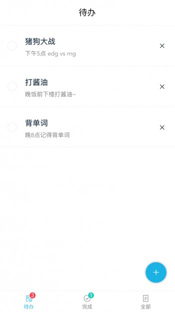
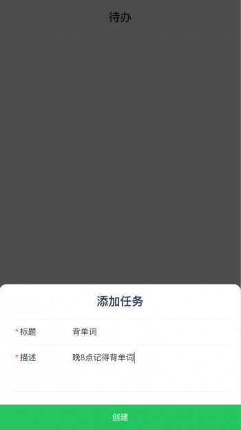
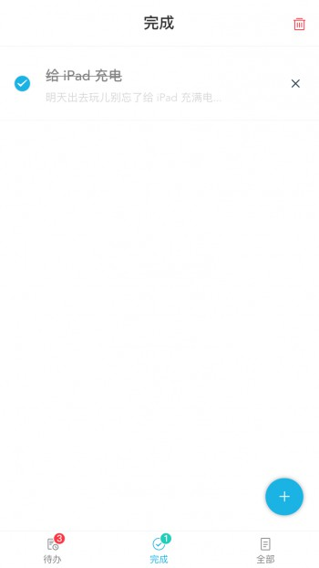

# vue-typescript-todolist

## 简介

使用 Vue + Vuex +TypeScript 搭建的一个经典 todo-list DEMO

<center>
  
  
</center>

<center>
  
  
</center>

## 安装 & 运行

```shell
npm install
npm run serve
```

## TS 在 Vue 中的写法

点击 `note.md` 文件查看详情。
